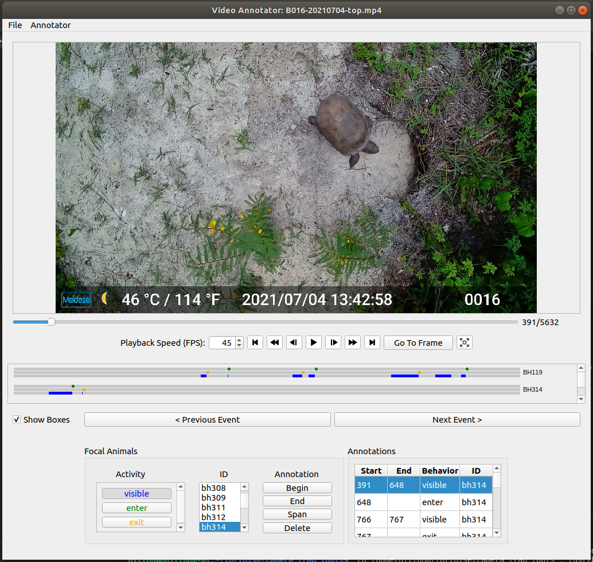

# annotator.py: Video Annotation Program

This program lets you annotate videos or image sequences, marking segments of the video where specific activities are taking place.  You can also associate each activity with a specific animal or animals.  The annotations are stored in text files that are separate from video and image files.

## Command Line Arguments
All arguments are optional; default values can be provided in a configuration file.
Short Form|Long Form|Type|Description
----------|---------|----|-----------
-c| --config|    path|      Configuration file.  If not provided, defaults to "annotator.config" located in the same directory as this program.

## Activities and Events
Activities come in two flavors: instantaneous and durational. Instantaneous activities occur at one instant in time, whereas durational activities have start and end times.  An "event" is either the time of an instantaneous activity, the start time of a durational activity, or the end time of a durational activity.

## Brief Tutorial



The annotator application window has three main sets of controls: the video viewing and navigation controls; the annotation navigation controls; and the annotation editing controls.  
- The video controls should be familiar to most people and will not be discussed further.
- The annotation navigation controls consist of the timeline plot and the previous/next event buttons.  The timeline plot displays the activities that have been assigned to specific animals.  The colors of the activities match the colors in the activity buttons found in the annotation editor.  If you click on an activity in the timeline, the video will move to the start frame of the activity.  The previous/next event buttons move the video to the frame associated with the previous/next event.
- The annotation editing controls let you add or delete activities from the timeline.  The appearance of the editing controls will change depending on the annotation mode selected in the configuration file.  There are three annotation modes: 
  - _Focal species mode_, where only one set of editing controls is displayed. The figure above shows focal species mode.
  - _Focal and Commensal species mode_, where two sets of editing controls are displayed.  Each set can contain different events and animal IDs.
  - _Counting mode_, which simplify marking video segments to indicate whether they contain a single animal or multiple animals.  You cannot specify which animal(s) are present.  The "Animals Present" buttons act as toggles, sometimes saving you the need to press the ```Begin``` or ```End``` buttons.


